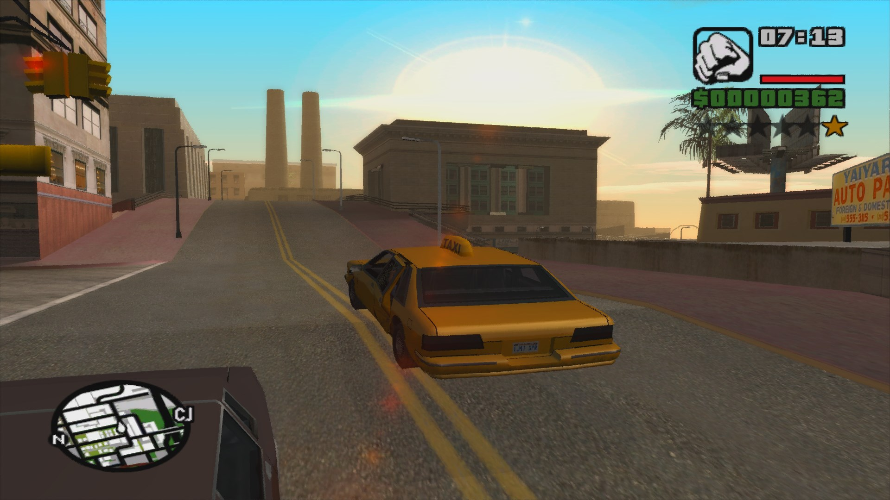
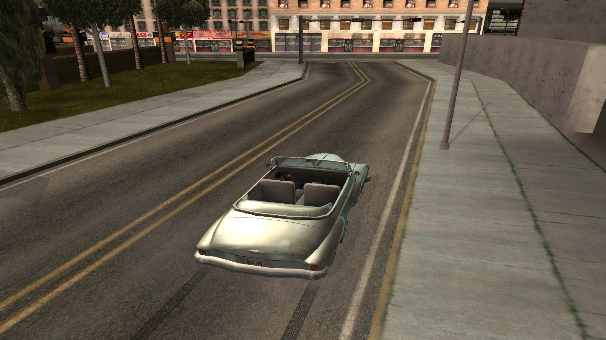
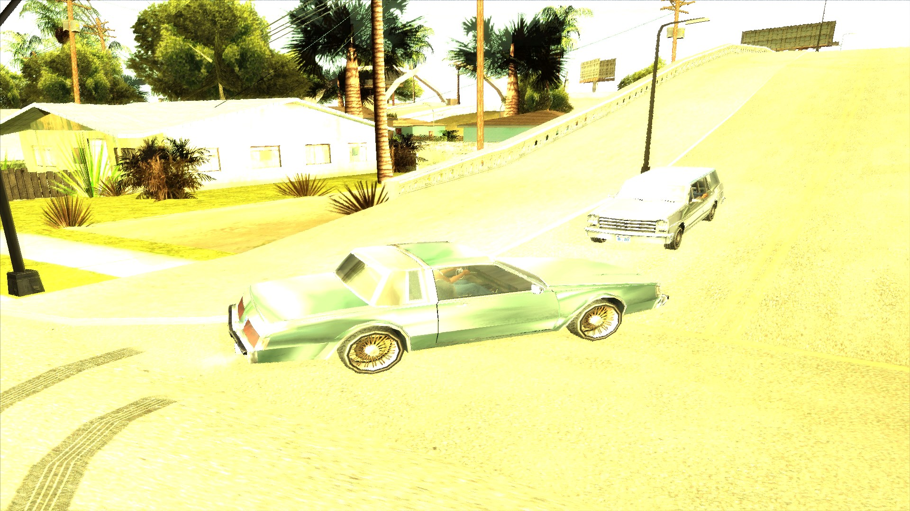
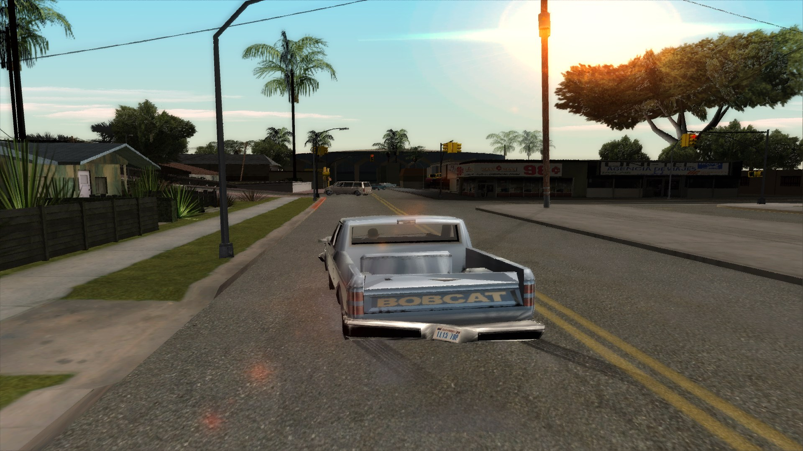
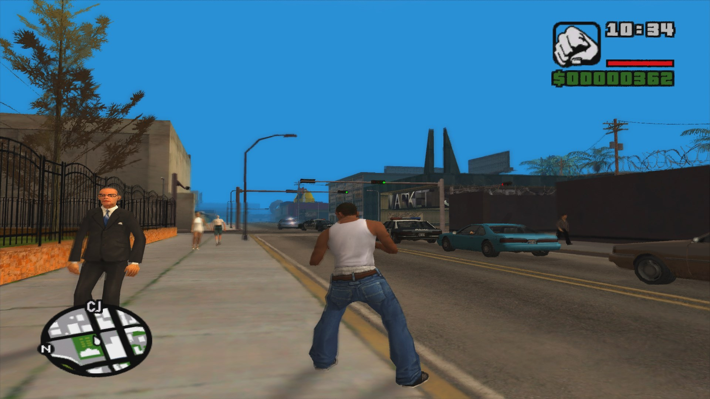
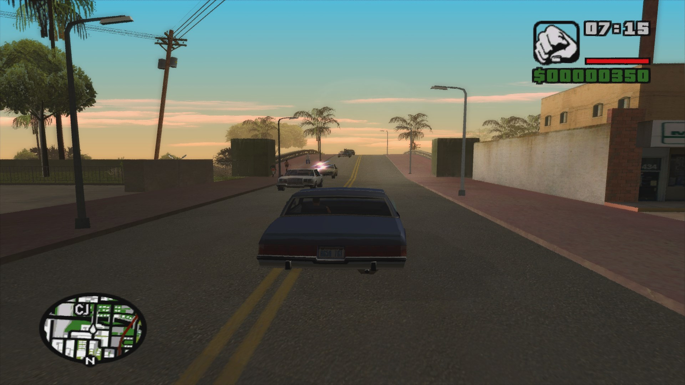
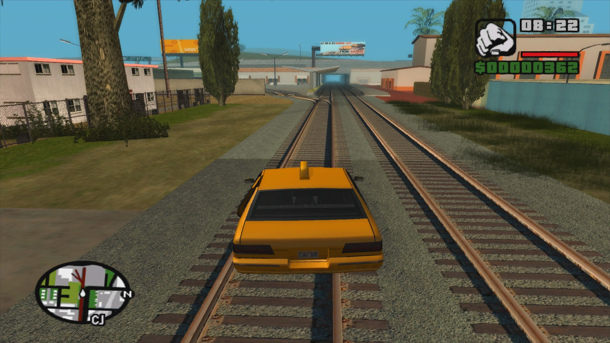
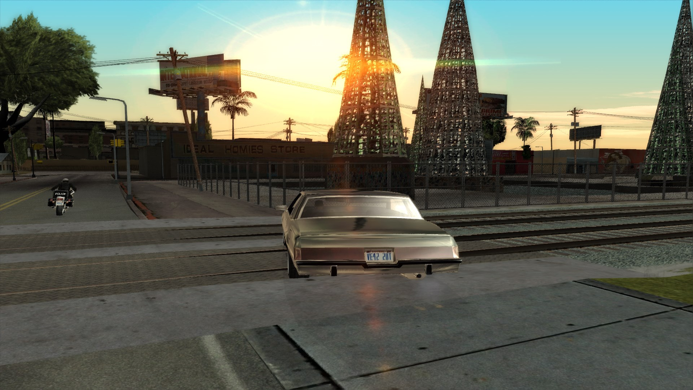
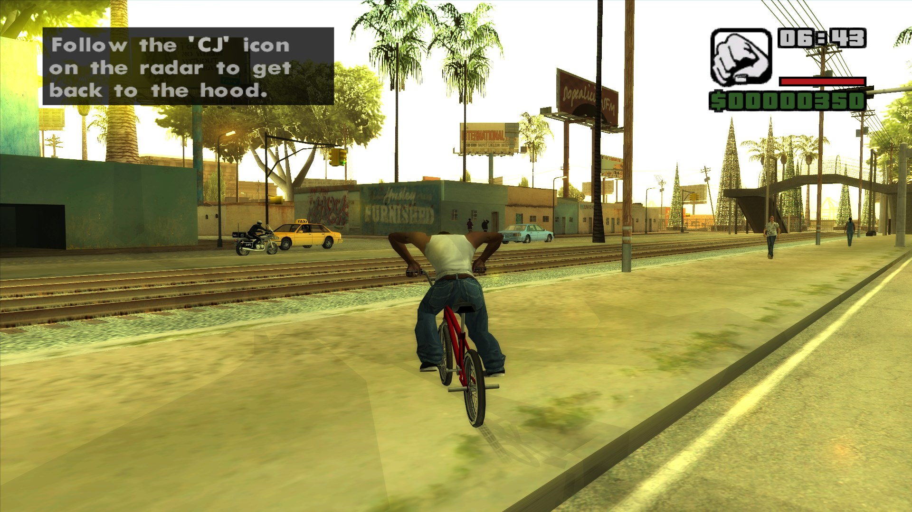
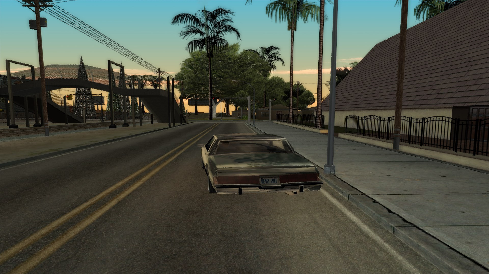

# SkyGFX Plus

A rewrite of [SkyGFX](https://github.com/aap/skygfx) by aap, bringing modern rendering features to GTA San Andreas while preserving the PS2 aesthetic.

## Screenshots












## Features

### Anti-Aliasing
- **SMAA** (Subpixel Morphological Anti-Aliasing) - 3-pass implementation with edge detection, blend weight calculation, and neighborhood blending
- Presets: LOW, MEDIUM, HIGH, ULTRA
- Configurable threshold and search steps

### Ambient Occlusion
- **SSAO** (Screen-Space Ambient Occlusion) - depth-based with configurable radius, power, and sample count
- Uses INTZ depth format when available

### Color Correction
- PS2 color filter with proper gamma correction for PC (gamma 2.2)
- Cross-mixable color filters (PS2, PC, Mobile, III, VC, VCS, GTAIV)
- GTA IV filmic tonemapping (Uncharted 2/Hable curve)
- YCbCr color correction

### Vehicle Rendering
- **PBR Vehicle Shader** - GGX specular, Fresnel reflection, material classification
- Support for 4 vehicle color channels (MAT1-MAT4)
- Chrome, paint, rubber, and glass material separation
- PS2 spherical environment mapping
- Dirt and rust layers

### Post-Processing
- **Motion Blur** - Burnout Paradise-style speed-based blur
- **SSS** (Subsurface Scattering) - post-process skin translucency
- **Skin Enhancement** - wrap lighting for SSS approximation
- **Hair Enhancement** - anisotropic highlights (Kajiya-Kay)
- **Vegetation Enhancement** - SSS-like translucency for grass
- **Edge Tessellation** - vertex displacement at edges

### Presets
- `gtaiv_modern.ini` - GTA IV style with PBR, all modern features
- `gtav_style.ini` - GTA V style, warm tones, soft reflections
- `classic_sa.ini` - Faithful PS2 look, no modern features
- `balanced.ini` - Best of all worlds, good performance

## Installation

1. Copy `skygfx.asi` to your GTA SA directory
2. Copy `skygfx.ini` to the same directory
3. Copy the `presets/` folder to the same directory (optional, for preset switching)
4. Edit `skygfx.ini` to configure features

## Configuration

Edit `skygfx.ini` to enable/disable features:

```ini
; Select a preset (set to "custom" to use settings below)
presetFile=custom

; Enable SMAA
smaaEnable=1
smaaPreset=3

; Enable SSAO
ssaoEnable=1

; Enable vehicle PBR
vehiclePipe=Neo
```

## Building

Requires:
- Visual Studio 2015+ (v140 toolset)
- DirectX SDK (June 2010)
- Python 3 (for shader compilation)

Build with:
```
msbuild build\skygfx.vcxproj /p:Configuration=Release /p:Platform=Win32
```

Compile shaders with:
```
python tools\compile_shaders.py
```

## Credits

### Original SkyGFX
- **aap** - Original SkyGFX author, the foundation of this project
- **Junior (JuniorDjjr)** - JuniorDjjr fork with extensive additional features and improvements
- **DK22Pac** - Normal mapping plugin for GTA SA
- **Silent** - SilentPatch and various GTA SA fixes
- **_AG** - RenderWare documentation and reverse engineering
- **The GTA Modding Community** - Reverse engineering, documentation, and countless hours of research

### Anti-Aliasing (SMAA)
- **Jorge Jimenez** - SMAA algorithm lead author, "Enhanced Subpixel Morphological Antialiasing" (2011)
- **Jose I. Echevarria** - SMAA co-author
- **Tiago Sousa** (Crytek) - SMAA co-author, later integrated into CryEngine
- **Diego Gutierrez** - SMAA co-author
- **Fernando Navarro** - SMAA co-author
- **Belen Masia** - SMAA co-author
- University of Zaragoza, Spain - SMAA research institution

### Anti-Aliasing (FXAA)
- **Timothy Lottes** (NVIDIA) - FXAA 3.11 author, revolutionized post-process AA
- **NVIDIA** - FXAA development and release

### Inspiration and Research
- **Crytek GmbH** - CryEngine rendering techniques that inspired modern game graphics
- **Tiago Sousa** (Crytek) - Brought SMAA into CryEngine, contributed to SSDO/SSGI
- **Crysis** (2007) - Set the benchmark for real-time graphics, influenced:
  - Screen-Space Directional Obscurance (SSDO)
  - Deferred shading pipelines
  - Material-based rendering systems
  - Real-time reflection techniques
- The "Crytek BRDF" approach to physically-based shading influenced the entire industry

### Rockstar Games
- **Rockstar North** - GTA San Andreas, the game this mod enhances
- **Rockstar Games** - GTA IV, GTA V, RDR2 - rendering techniques inspired by their titles
- The RAGE engine's approach to vehicle rendering, filmic tonemapping, and post-processing influenced our implementation

### PBR / Modern Rendering
- **O3DE Foundation** - Atom renderer reference for PBR pipeline architecture
- **Epic Games** - Unreal Engine's material system influenced our approach
- **The PBR Revolution** - The shift to physically-based rendering in games (2013+) influenced our material classification system

### RenderWare
- **Criterion Games** - RenderWare Graphics engine that powers GTA SA
- **Criterion Software** - Original RW development

### Academic Research
- **"A Practical Model for Subsurface Light Transport"** (Jensen et al., 2001) - SSS theory
- **"Microfacet Models for Refraction through Rough Surfaces"** (Walter et al., 2007) - GGX distribution
- **"Filmic Tonemapping"** (Hable, Uncharted 2) - Tonemapping curves used in GTA IV/V
- **"Physically-Based Shading at Disney" (Burley, 2012)** - Disney BRDF that influenced PBR

### Open Source Community
- **Dear ImGui** - Debug menu interface
- **stb libraries** - Image loading utilities
- **The Khronos Group** - OpenGL/GLSL specifications
- **Microsoft** - DirectX 9 SDK and documentation

### Special Thanks
- **The GTA SA Modding Community** - For reverse engineering and documentation
- **GTAForums** - Community knowledge base
- **Everyone who contributed** to the original SkyGFX and its forks
- **Rockstar Games** - For creating the GTA series
- **Crytek** - For pushing the boundaries of real-time rendering
- **NVIDIA / AMD** - For GPU hardware and driver support

## Important Notice on Source Code

**No source code from Crytek, Rockstar, or any other commercial entity has been used in this project.**

All code in this project is:
- **Original work** by the SkyGFX Plus contributors
- **Inspired by** rendering techniques and approaches from various game engines and research papers
- **Based on deep reverse engineering** efforts by the GTA modding community
- **Written from scratch** using publicly available documentation and specifications

The rendering techniques implemented here are based on:
- **Published academic research** (SMAA, PBR, GGX BRDF, etc.)
- **Public documentation** (DirectX 9 SDK, RenderWare documentation)
- **Community reverse engineering** of GTA SA's rendering pipeline
- **Publicly known rendering techniques** used across the game industry

All shader code, C++ code, and configuration files are original implementations that achieve similar visual results to commercial engines through standard graphics programming techniques.

## License

This project is based on SkyGFX by aap. See the original SkyGFX license for details.

SMAA is licensed under the BSD license. See `SMAA_reference/LICENSE.txt` for details.

FXAA is property of NVIDIA Corporation.

Rendering techniques inspired by Rockstar Games titles (GTA IV, GTA V, RDR2).

O3DE reference code is licensed under the Apache 2.0 license.

All original code in this project is licensed under the same terms as the original SkyGFX project.
